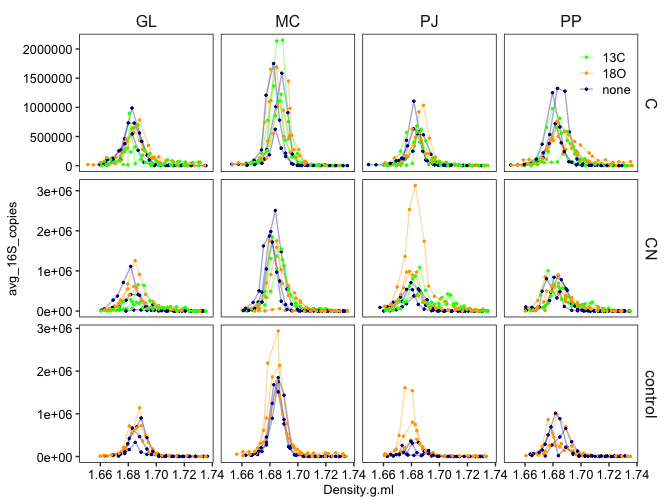
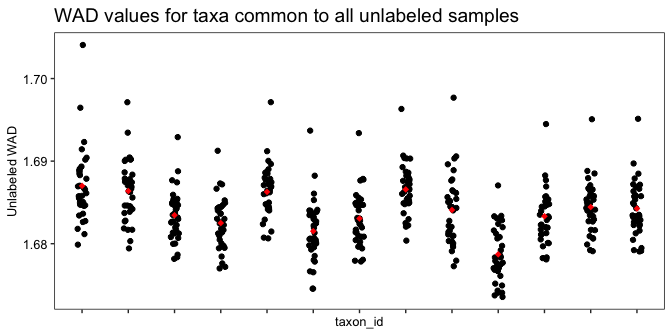
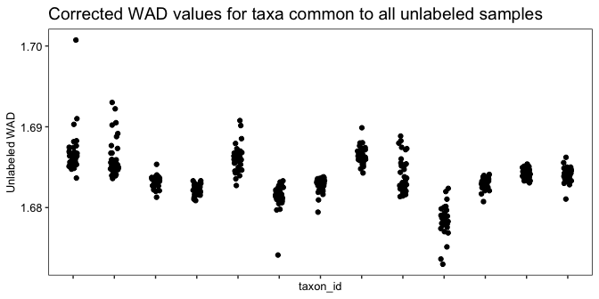
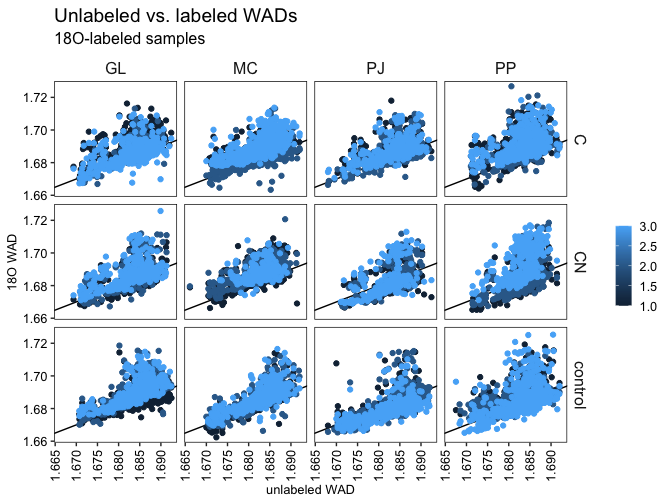
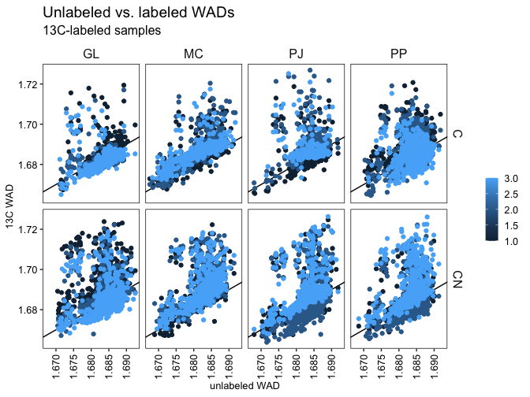
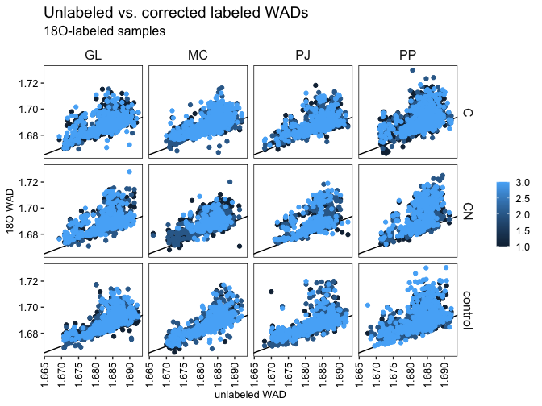
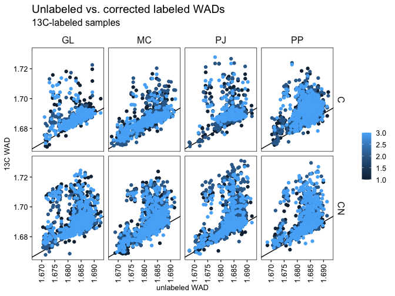
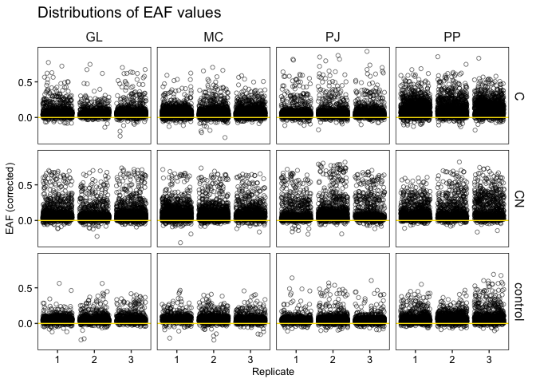
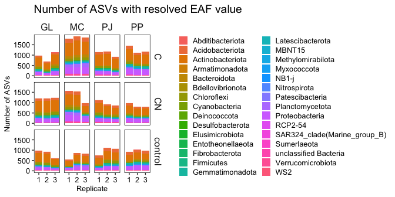
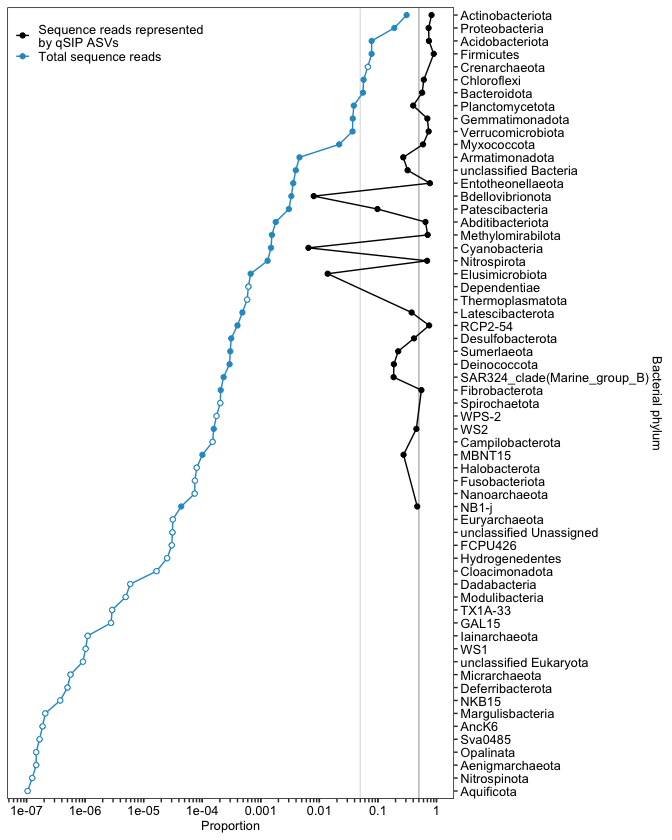

## Background

This tutorial is designed as a basic guide through the quantitative
stable isotope (qSIP) calculation process with example data provided.
The tutorial is divided up into four parts:

1.  Density curves (and initial data quality checking)
2.  Per-taxon densities (and quality filtering)
3.  Per-taxon enrichment calculations (and additional filtering)
4.  Taxonomic representation of screened data

**Data and calculations correspond to the following publication:**

Stone BW, Dijkstra P, Finley BK, *et al.*. Life history strategies among
soil bacteria—dichotomy for few, continuum for many *ISME Journal* 2023,
DOI:
[10.1038/s41396-022-01354-0](https://doi.org/10.1038/s41396-022-01354-0).

<br>

**Quantitative stable isotope probing (qSIP)** is the combination of
stable isotope probing with targeted amplicon sequencing data of
microbial communities. In conventional stable isotope probing (SIP)
experiments, identification of the amount of isotopic enrichment of
nucleic acids was done qualitatively – through visual identification and
categorization of nucleic acids into either “heavy” or “light” regions.
The qSIP approach is to divide a single sample into many different
fractions (without *a priori* categorization) along a gradient of
increasing densities, and to estimate the shift in density of an
individual microbial taxon’s nucleic acids based on it’s abundance
across the many fractions. For details on the qSIP methodology see
below:

Hungate BA, Mau RL, Schwartz E *et al.* Quantitative Microbial Ecology
through Stable Isotope Probing. *Applied and Environmental Microbiology*
2015;**81**, DOI:
[10.1128/AEM.02280-15](https://doi.org/10.1128/AEM.02280-15).

Purcell AM, Dijkstra P, Finley BK *et al.* Quantitative Stable Isotope
Probing with H218O to Measure Taxon-Specific Microbial Growth. *Methods
of Soil Analysis* 2019;**4**, DOI:
[10.2136/msa2018.0083](https://doi.org/10.2136/msa2018.0083).

### Terminology

In an amplicon sequencing study, a single sequencing sample is usually
produced from DNA extracted from a single point of collection (unless
samples are pooled, in which case many points of collection yield one
sequencing sample). In a qSIP experiment, DNA from each sample is
divided into usually more than a dozen fractions which must all be
sequenced separately. Because of this, consistent terminology should be
applied to any qSIP experiment.

-   **Replicate** - A single physical sample that has been divided into
    multiple fractions (usually 10–20). The term *replicate* is used
    rather than *sample* to avoid confusion during the sequencing
    preparation process, in which each qSIP fraction must be treated as
    a separate sample. Furthermore, the term *replicate* makes it clear
    that these represent the unit of statistical replication and power.
-   **Fraction** - A subsample produced by fractionating a single
    replicate based on vertical stratification following
    ultra-centrifugation. *Each fraction must have its own qPCR amplicon
    abundance measurement as well as a density measurement.*
-   **Feature Table** - Often called an OTU table, ASV table, or species
    abundance table. A table of abundances or relative frequences for
    each microbial taxon in each sample. For qSIP analyses, feature
    tables must include the abundances/frequencies in *each* fraction.
    For qSIP analyses, this should not be a binary presence-absence
    table.
-   **Labeled** - A replicate that has been treated with a stable
    isotope (<sup>18</sup>O, <sup>13</sup>C, or <sup>15</sup>N). Often
    used to differentiate labeled from unlabeled values in output from
    the qsip package (as well as represented in equations throughout the
    published literature).
-   **Light** - A replicate that has **not** been treated with a stable
    isotope. An unlabeled replicate.
-   **excess atom fraction (EAF)** - The proportion \[0–1\] of an
    organism’s nucleic acids that are enriched by a stable isotope.
    Identical to **atom percent excess (APE)** or **atom excess percent
    (AEP)**.

## 1. Density curves

Density curves simply plot the amount of DNA, or specific sequences if
using qPCR, across all of the fractions that you have laboriously
separated your sample into following ultracentrifugation. This
exploration of the data should be done prior to sequencing to ensure
that sequencing will be successful. They serve as your initial screen of
data quality because they show whether you have created “heavier” DNA
during the course of your incubation. If you generate more samples than
you plan to sequence (why would you do this?), you can use this step to
prioritize your sequencing efforts. However, you are more than likely
using it to determine if you need to respin and re-fractionate any of
your samples.

**Necessary columns to plot density curves**

-   ID column corresponding to unique replicates
-   Density value of fraction **OR** fraction number
-   Quantification of microbial abundance (DNA qubit, qPCR) for each
    fraction

<!-- -->

    ##       sample_id fraction ecosystem treatment isotope Density.g.ml avg_16S_copies
    ##    1:  W1_GL_24       10        GL         C     18O     1.692310     247688.560
    ##    2:  W1_GL_24       11        GL         C     18O     1.688010     431470.520
    ##    3:  W1_GL_24       12        GL         C     18O     1.683711     653857.275
    ##    4:  W1_GL_24       13        GL         C     18O     1.679412     418478.894
    ##    5:  W1_GL_24       14        GL         C     18O     1.675113      99755.087
    ##   ---                                                                           
    ## 1523:  W1_PP_30        5        PP        CN     18O     1.718576       9667.252
    ## 1524:  W1_PP_30        6        PP        CN     18O     1.715418      34786.829
    ## 1525:  W1_PP_30        7        PP        CN     18O     1.712259      73805.120
    ## 1526:  W1_PP_30        8        PP        CN     18O     1.705942     107426.250
    ## 1527:  W1_PP_30        9        PP        CN     18O     1.701731      97535.211

``` r
ggplot(density_data,
       aes(Density.g.ml, avg_16S_copies, color = isotope)) +
  geom_line(aes(group = sample_id), alpha = 0.35) +
  geom_point(size = .5) +
  facet_grid(treatment ~ ecosystem, scales = 'free_y') +
  scale_color_manual(values = c('green', 'orange', 'darkblue')) +
  theme(legend.position = c(1, 1),
        legend.justification = c(1, 1))
```



In this experiment, soils from four ecosystems were given a combination
of treatments including glucose as a carbon source, glucose and ammomium
as a carbon and nitrogen source, or were unamended. To trace growth of
microbial taxa, treatments were either amended with
<sup>13</sup>C-glucose, <sup>18</sup>O-H\[2\]O, or non-isotopically
enriched counterparts.

**Ecosystems:**

-   GL (high desert grassland)
-   MC (mixed conifer forest)
-   PJ (Pinyon pine and juniper forest and scrubland)
-   PP (Ponderosa pine forest)

**Treatments:**

-   Control (no nutrient amendments)
-   C (glucose only)
-   CN (glucose + ammonium)

<br> <br>

## 2. Per-taxon densities

Following amplicon sequencing, the resulting feature table should be
combined with densities, amplicon abundances (typically from qPCR) into
a long-format table – where each taxon in each fraction has it’s own
row.

**Necessary columns for qSIP calculations:**

-   ID column corresponding to unique replicates
-   ID column corresponding to each unique replicate-fraction. I’m
    putting it in *necessary* column list because you have already
    needed it to join your sequencing data (which were generated for
    each fraction) to your experimental data
-   taxonomic ID column
-   Density value of fraction **OR** fraction number (if using internal
    standards)
-   Quantification of microbial abundance (DNA qubit, qPCR) for each
    fraction
-   Sequence reads (for each taxon in each fraction). **Sequence reads
    should be as unfiltered as possible with the exception of removing
    global singleton and doubleton features**. Further, sequence reads
    are **not** normalized – that will be done after removing off-target
    sequences

**Example data format:**

``` r
dat
```

    ##          sample_id rep sample_fraction ecosystem sample fraction Density.g.ml avg_16S_copies dna_ng_ul uL_added dry_soil_wt_g avg_16S_g_soil                         taxon_id seq_abund tot_seq iso_trt isotope treatment
    ##       1:  W1_GL_24   3     W1_GL_24_10        GL     21       10     1.692310      247688.56      21.6       50     0.2556977      2092342.9 4d191af12058762054b8be696bce4752      6069   46780   label     18O         C
    ##       2:  W1_GL_24   3     W1_GL_24_10        GL     21       10     1.692310      247688.56      21.6       50     0.2556977      2092342.9 42c49eedf842001bf53ae108f337e0a3       332   46780   label     18O         C
    ##       3:  W1_GL_24   3     W1_GL_24_10        GL     21       10     1.692310      247688.56      21.6       50     0.2556977      2092342.9 b2182bbe3a4378a3c359d6cd978e4135        53   46780   label     18O         C
    ##       4:  W1_GL_24   3     W1_GL_24_10        GL     21       10     1.692310      247688.56      21.6       50     0.2556977      2092342.9 6be97e5a9f911ec78b02ec984c9d5788        34   46780   label     18O         C
    ##       5:  W1_GL_24   3     W1_GL_24_10        GL     21       10     1.692310      247688.56      21.6       50     0.2556977      2092342.9 6d2a43975570769404a60e85bce9f2c7       733   46780   label     18O         C
    ##      ---                                                                                                                                                                                                                 
    ## 1038253:  W1_PP_30   3      W1_PP_30_9        PP     96        9     1.701731       97535.21      23.1       43     0.3234387       696596.7 3ba8bbb5838208e4715980014531d24c         3   18237   label     18O        CN
    ## 1038254:  W1_PP_30   3      W1_PP_30_9        PP     96        9     1.701731       97535.21      23.1       43     0.3234387       696596.7 9a9a5b2025b24781f0f6af9bc9038be0         3   18237   label     18O        CN
    ## 1038255:  W1_PP_30   3      W1_PP_30_9        PP     96        9     1.701731       97535.21      23.1       43     0.3234387       696596.7 241b0f9ef13084d7f30bb2223d5443f8         3   18237   label     18O        CN
    ## 1038256:  W1_PP_30   3      W1_PP_30_9        PP     96        9     1.701731       97535.21      23.1       43     0.3234387       696596.7 ec3d2e94e99213c787f3714e8d1474fd         3   18237   label     18O        CN
    ## 1038257:  W1_PP_30   3      W1_PP_30_9        PP     96        9     1.701731       97535.21      23.1       43     0.3234387       696596.7 327f01c11acc49afb9e75ebce63a14cc         2   18237   label     18O        CN

There are additional columns which are not strictly necessary but which
were useful in data organization. It is encouraged to create the columns
needed to effectively manage your data

We also have the taxonomic data of our features:

``` r
tax
```

    ##                                 taxon_id Confidence  Kingdom           Phylum               Class                       Order                      Family                       Genus                        Species
    ##      1: 00005203959121af368b1aace3301909  1.0000000 Bacteria Bdellovibrionota         Oligoflexia                   0319-6G20                   0319-6G20                   0319-6G20         unclassified 0319-6G20
    ##      2: 0000d86b3a0ac4f5a60f508efe59203a  1.0000000 Bacteria      Chloroflexi                TK10                        TK10                        TK10                        TK10              unclassified TK10
    ##      3: 0001311193dd18e7057e20a500bcde6d  0.7748480 Bacteria  Acidobacteriota      Blastocatellia            Blastocatellales           Blastocatellaceae                 Aridibacter       unclassified Aridibacter
    ##      4: 0002785c4e829007dd2ab6f13a5d2068  0.7917043 Bacteria      Myxococcota           Polyangia                Polyangiales               Polyangiaceae  unclassified Polyangiaceae     unclassified Polyangiaceae
    ##      5: 000310bbe703f738ac49034fe695ae68  0.9991491 Bacteria  Planctomycetota      Planctomycetes               Isosphaerales              Isosphaeraceae                 Aquisphaera       unclassified Aquisphaera
    ##     ---                                                                                                                                                                                                             
    ## 117567: fffef7de363ea89941cb8145cde789df  0.8525603 Bacteria   Proteobacteria Gammaproteobacteria             Burkholderiales            Burkholderiaceae                   Pandoraea               Burkholderia_sp.
    ## 117568: ffff273eada9257634bc6959697730eb  0.9937468 Bacteria  Patescibacteria     Saccharimonadia           Saccharimonadales           Saccharimonadales           Saccharimonadales unclassified Saccharimonadales
    ## 117569: ffff2aa244f2aee854aaa2d70e876705  0.9178987 Bacteria   Proteobacteria Alphaproteobacteria            Sphingomonadales           Sphingomonadaceae              Porphyrobacter             Porphyrobacter_sp.
    ## 117570: ffff4f6c5c1b8be9d48d28c1b0ca14fd  0.9489862 Bacteria Actinobacteriota      Acidimicrobiia unclassified Acidimicrobiia unclassified Acidimicrobiia unclassified Acidimicrobiia    unclassified Acidimicrobiia
    ## 117571: ffffada1b15ffafb0b2aa03493c1dd92  0.9967684 Bacteria   Proteobacteria Gammaproteobacteria             Methylococcales           Methylomonadaceae               Methylobacter     unclassified Methylobacter
    ##                                                                                                                                                                                                                                              representative_sequence
    ##      1:  ACGAGGGGTGCAAGCGTTGCTCGGAATTATTGGGCGTAAAGGGTTGGTAGGTGGTCTTGTTTGTCTAGGGTGAAATCCCATGGCTTAACTGTGGAAGTGCCCTAGAAACGGCAAGACTAGAGTCCTAGAGGGGTTCGTGGAATTCCCGGTGTAGCGGTGAAATGCGTAGAGATTGGGAGGAACACCAGCGGCGAAGGCGGCGAACTGGATAGGTACTGACACTCAACAACGAAAGCGTGGGGAGCAAACAG
    ##      2:  ACGTAGGGTGCGAGCGTTGCCCGGATTTATTGGGCGTAAAGGGCGCGCAGGCGGCCACGCACGTCCGTTGTGAAATCTCTCGGCTCAACTGGGCGGGGTCAGCGGATACGGCGTGGCTGGAGCAAGCTAGGGGGCAATGGAATTCCCGGTGTAGTGGTGGAATGCGTAGATATCGGGAGGAACACCAGTGGCGAAGGCGGTTGCCTGGAGCTTTGCTGACGCTGAGGCGCGAAAGCGTGGGGAGCGATCCT
    ##      3: ACGTAGGGACCAAGCGTTGTTCGGATTTACTGGGCGTAAAGGGCGCGTAGGCGGCGTGACAAGTCACTTGTGAAATCTCCGGGCTTAACCCGGAACGGTCAAGTGATACTGTCGTGCTAGAGTGCAGAAGGGGCAATCGGAATTCTTGGTGTAGCGGTGAAATGCGTAGATATCAAGAGGAACACCTGAGGTGAAGACGGGTTGCTGGGCTGACACTGACGCTGACAGCGCGAAAGCTAGGGGAGCAAACGG
    ##      4:  ACAGAGGGTGCAAACGTTGTTCGGAATTACTGGGCGTAAAGCGCGTGTAGGCTGCTCTGCAAGTCGGGTGTGAAAGCCCCGGGCTCAACCTGGGAAGTGCACTCGAAACTGCAGAGCTCGAGTTCTGGAGAGGAAGGCGGAATTCTCGGTGTAGAGGTGAAATTCGTAGATATCGAGAGGAACACCGGTGGCGAAGGCGGCCTTCTGGACAGTGACTGACGCTGAGACGCGAAAGCGTGGGGAGCAAACAG
    ##      5: ACGAACCGTGCGAACGTTATTCGGAATCACTGGGCTTAAAGCGCGTGTAGGCGGATGGGAACGTCGGTAGTTGAAAGCCCCCGGCTCAACCGGGGAAGTGGTGCCGAAACGACCCGTCTGGAGGGACGTAGGGGGACCTGGAACTTCCGGTGGAGCGGTGAAATGCGTTGAGATCGGAAGGAACGCCCGTGGCGAAAGCGAGGTCCTGGACGTCTACTGACGCTGAGACGCGAAAGCTAGGGGAGCAAACGG
    ##     ---                                                                                                                                                                                                                                                             
    ## 117567:  ACGTAGGGTGCAAGCGTTAATCGGAATTACTGGGCGTAAAGCGTGCGCAGGCGGTTTGTTAAGACGGACGTGAAATCCCCGGGCTCAACCTGGGAACTGCATTCGTGACTGGCAAGCTAGAGTATGGCAGAGGGGGGTGGAATTCCACGTGTAGCAGTGAAATGCGTAGAGATGTGGAGGAACACCGATGGCGAAGGCAGCCCCCTGGGCCAATACTGACGCTCATGCACGAAAGCGTGGGGAGCAAACAG
    ## 117568:  ACGTAGGGTCCAAGCGTTATCCGGAATCACTGGGCGTAAAGCGTGCGTAGGCGGACTGTTAAGTGAGATGTGAAATCGTGTGGCTCAACCATATCGATGTGTCTCATACTGGCAGACTAGAGGATAGCAGAGGCAAGTGGAATTACGAGTGTAGCAGTGAAATGCGTAGATATTCGTAGGAACACCAATGGCGAAGGCAGCTTGCTGGGCTATTTCTGACGCTGAGGCACGAAAGCGTGGGGAGCGAACAG
    ## 117569:  ACGGAGGGGGCTAGCGTTGTTCGGAATTACTGGGCGTAAAGCGCACGTAGGCGGCCTTTTAAGTCAGGGGTGAAATCCCGGGGCTCAACCCCGGAACTGCCCTTGAAACTGGGAGGCTAGAATCTTGGAGAGGCGAGTGGAATTCCGAGTGTAGAGGTGAAATTCGTAGATATTCGGAAGAACACCAGTGGCGAAGGCGACTCGCTGGACAAGTATTGACGCTGAGGTGCGAAAGCGTGGGGAGCAAACAG
    ## 117570:  ACGTAGGGTGCAAGCGTTGTCCGGATTTATTGGGCGTAAAGAGCTCGTAGGCGGCTTAGCAAGTCGGAAGTTAAAACAAGAGGCTTAACCTCTTGTCGCTTTCGATACTGCTATGGCTTGAGTCTGGTAGGGGATGACGGAATTCCACGTGTAGCGGTGAAATGCGCAGATATGTGGAGGAACACCGGTGGCGAAGGCGGTCATCTGGGCCAGTACTGACGCTGAGGAGCGAAAGCGTGGGGAGCGAACAG
    ## 117571:  ACGGAGGGTGCAAGCGTTAATCGGAATTACTGGGCGTAAAGCGTGCGTAGGCGGTTATTTAAGTCAGATGTGAAAGCCCCGGGCTTAACCTGGGAACTGCATTTGATACTGGGTAACTAGAGTTTAATAGAGGAGAGTGGAATTTCAGGTGTAGCGGTGAAATGCGTAGAGATCTGAAGGAACACCAGTGGCGAAGGCGACTCTCTGGATTAAAACTGACGCTGAGGTACGAAAGCGTGGGTAGCAAACAG

<br>

### Filtering – removing fractions

As seen from density curves, there are many fractions with a very low
proportion of the community. These fractions are usually near the
endpoints of the curve, which are susceptible to having drastically
different density values than would be expected given the typical
progression of densities along the curve.

Therefore, it is reasonable to remove these fractions, either by density
value, fraction number, of sequence read count.

``` r
dat <- dat[tot_seq > 3500]
```

### Filtering – removing lineages

Depending on quantification method, and sequencing targets, sequences
should be relativized based on the relevant organisms of your study.

For example, this study quantified bacterial 16S sequences with primers
meant to exclude Eukarya and Archaea. **Therefore, relative abundances
should only reflect our target organisms.**

So in this case, we need to remove:

-   Unassigned reads
-   Eukarya
-   Archaea
-   Mitochondrial and chloroplast sequences

First, how many taxa and how many sequence reads to we have? Reviewers
typically want to know this, better to have these numbers now than have
to go digging later.

``` r
# function which prints sequence count and ASV count
seq_check <- function(x) {
  nums <- formatC(c(x[, sum(seq_abund)], x[, uniqueN(taxon_id)]), format = 'fg', width = 12, big.mark = ',')
  cat(nums[1], ' sequences\n', nums[2], ' ASVs', sep = ''); cat('\n')
}

# sequence and ASV count? 
seq_check(dat)
```

    ##   47,741,040 sequences
    ##      116,657 ASVs

Next, we remove off-target sequences, keeping track of how many are
removed

``` r
unassign <- tax[Kingdom == 'Unassigned', taxon_id]
euk <- tax[Kingdom == 'Eukaryota', taxon_id]
arch <- tax[Kingdom == 'Archaea', taxon_id]
mito_chloro <- tax[, tax_string := paste(Phylum, Class, Order, Family, Genus, Species, sep = ';')
                   ][grepl('mitochond|chloroplast', tax_string, ignore.case = T), taxon_id]

cat('Unassigned\n'); seq_check(dat[taxon_id %in% unassign]) 
cat('Eukarya\n'); seq_check(dat[taxon_id %in% euk])  
cat('Archaea\n');seq_check(dat[taxon_id %in% arch]) 
cat('Mitochondria, Chloroplasts\n');seq_check(dat[taxon_id %in% mito_chloro])  

dat <- dat[!taxon_id %in% c(arch, mito_chloro, euk, unassign)]

# how many sequences and taxa left?
cat('\n\nFinal after filtering\n'); seq_check(dat)
```

    ## Unassigned
    ##        1,480 sequences
    ##           58 ASVs
    ## Eukarya
    ##           51 sequences
    ##            6 ASVs
    ## Archaea
    ##    3,251,795 sequences
    ##          821 ASVs
    ## Mitochondria, Chloroplasts
    ##      105,731 sequences
    ##        1,004 ASVs
    ## 
    ## 
    ## Final after filtering
    ##   44,381,983 sequences
    ##      114,768 ASVs

Now that off-target sequences have been removed, we can normalize our
sequences

``` r
# normalize 16S abundances of bacteria
dat[, rel_abund := seq_abund / sum(seq_abund), by = sample_id]
```

<br>

### Setting frequency thresholds

The next decision is whether to keep, or to remove rare and infrequent
lineages. There is no strong agreement among qSIP-users on whether to do
this. Rare and infrequent taxa produce noise in the data, making it hard
to discern quality.

The one guiding principle that there may be agreement on is that it’s
best to set minimum filters at first – i.e. be as inclusive as possible
– and only intensify filters as needed to reduce noise.

``` r
# frequency thresholds
min_frac_threshold <- 3
min_rep_threshold <- 2

# apply fraction frequency thresholds
dat <- dat[, frac_freq := .N, by = .(taxon_id, sample_id)
           ][frac_freq >= min_frac_threshold
             ][, frac_freq := NULL]

# check sequence abundance and diversity
seq_check(dat)
```

    ##   33,454,287 sequences
    ##       14,499 ASVs

There is a significant drop-off in the number of ASVs, but a small loss
of overall sequence count. This is pretty typical since bacterial
communities follow a log-normal abundance distribution (few taxa make up
much of the abundances).

<br>

### Calculating per-taxon weighted average densities (WADs)

The following code uses `data.table` syntax to calculate in which
fraction a taxon is most present, and creates a tube-wide density
measure weighted by all fractions.

The `wvd` term produced is the *weighted variance in density*,
essentially a measure of how spread-out an orgnanism’s WAD value is. It
is not strictly necessary for the qSIP calculations. It can sometimes be
useful as a diagnostic of the quality of an organism’s density estimate.

It is necessary here to include the key grouping variables of the
experiment in the final line of the calculation.

``` r
# Grouping variables
########################################
vars_to_keep <- 'rep'
grouping_vars <- c('ecosystem', 'treatment', 'isotope')
########################################

# calculate WADs
dat <- dat[, abund_16s := rel_abund * avg_16S_g_soil, by = .(taxon_id, sample_fraction)
           ][, tot_abund := sum(abund_16s), by = .(taxon_id, sample_id) # group by replicate here, not sample-fraction
             ][, weight := abund_16s / tot_abund, by = .(taxon_id, sample_fraction)
               ][, .(wad = sum(weight * Density.g.ml, na.rm = T),
                     wvd = sum(weight * (Density.g.ml - sum(weight * Density.g.ml, na.rm = T))^2, na.rm = T),   # weighted variance of density
                     abund_16s = sum(abund_16s, na.rm = T)),
                 by = c('taxon_id', 'sample_id', 'iso_trt', vars_to_keep, grouping_vars)
                 ][wad > 0]

dat
```

    ##                                 taxon_id sample_id iso_trt rep ecosystem treatment isotope      wad          wvd    abund_16s
    ##      1: 4d191af12058762054b8be696bce4752  W1_GL_24   label   3        GL         C     18O 1.686316 4.106933e-05 150610.07289
    ##      2: 42c49eedf842001bf53ae108f337e0a3  W1_GL_24   label   3        GL         C     18O 1.694855 8.135180e-05  10948.82113
    ##      3: 6d2a43975570769404a60e85bce9f2c7  W1_GL_24   label   3        GL         C     18O 1.687137 7.388405e-05  11920.59374
    ##      4: 322600d479751bc17a4ea5177cb38122  W1_GL_24   label   3        GL         C     18O 1.686451 5.907355e-05  17333.08755
    ##      5: 8bb7877fd56f2cad78ad527196262789  W1_GL_24   label   3        GL         C     18O 1.684243 5.615706e-05   6720.02148
    ##     ---                                                                                                                      
    ## 106732: 8c0d88a79671809061cd6b9c19c7f378  W1_PP_30   label   3        PP        CN     18O 1.711177 2.256805e-05    142.77264
    ## 106733: 848657ed167d1f46ffbe9f20c785b5dd  W1_PP_30   label   3        PP        CN     18O 1.711806 1.056120e-05     45.43522
    ## 106734: 34b2880194d8c286221d459c18b5b85e  W1_PP_30   label   3        PP        CN     18O 1.708504 2.583912e-05    165.23326
    ## 106735: 55543ac7f4991930fe549f57efbbe723  W1_PP_30   label   3        PP        CN     18O 1.705071 1.850284e-05     59.86524
    ## 106736: eda5a2084ad31fbf6e23501bed08e9de  W1_PP_30   label   3        PP        CN     18O 1.707287 2.286791e-05    166.30806

<br>

### Applying replicate-frequency thresholds

The WAD values are replicate-level (i.e., tube-level) data so now taxa
can be filtered according to their frequency across replicates

To maximize the number of ASVs retained, unlabeled replicates are
grouped together for this step Unlabeled WADs of taxa are typically
averaged together but this shouldn’t be done if it is suspected that
isotopic composition may differ between unlabeled samples. Frequency
among the labeled samples is evaluated across replicates within the main
experimental groups.

``` r
# experimental grouping variables
exp_group_vars <- c('harvest_day', 'temp')

# apply replicate frequence thresholds
# for labeled samples - must occur in minimum number of reps by treatment and ecosystem
dat <- dat[isotope != 'none', rep_freq := uniqueN(sample_id), by = c('taxon_id', grouping_vars)
           ][isotope == 'none', rep_freq := uniqueN(sample_id), by = taxon_id
             ][rep_freq >= min_rep_threshold
               ][, rep_freq := NULL]

dat[, uniqueN(taxon_id)]
```

    ## [1] 6372

The number of taxa at this point will closely resemble the final data.

<br> <br>

## 2b. Correcting densities

It is necessary to look at the quality of the data and correct density
estimates across tubes. Differences in CsCl gradient prep and sample
handling mean that densities in each tube are just a little bit
different.

<br>

### Unlabeled WAD correction

First, identify taxa common to all unlabeled samples

``` r
# number of unlabeled samples
common_light <- dat[iso_trt == 'light'
                    ][, num_reps := uniqueN(sample_id), by = taxon_id
                      ][num_reps == 36
                        ][, .(sample_id, taxon_id, wad)]

# how many common taxa?
common_light[, uniqueN(taxon_id)]
```

    ## [1] 13

``` r
ggplot(common_light, aes(taxon_id, wad)) +
  geom_jitter(width = 0.1) +
  geom_point(data = common_light[, .(wad = mean(wad)), by = taxon_id], color = 'red', shape = 18, size = 2) +
  ylab('Unlabeled WAD') +
  labs(title = 'WAD values for taxa common to all unlabeled samples') +
  theme(axis.text.x = element_blank())
```



This plot shows how the natural densities of organisms can be quite
different. The red diamonds represent averages for each organism. To
identify tube-level biases, look for tubes that contribute consistently
heavy or consistently light values to the taxa.

``` r
light_shift <- common_light[, true_wad := median(wad), by = taxon_id
                            ][, diff_from_true := wad - true_wad
                              ][, .(tube_shift = mean(diff_from_true)), by = sample_id]
```

This is done by looking at the difference between each taxon’s density
and it’s global (“true”) WAD. Tubes with consistently high values will
have a higher `wad_diff` value and thus a higher `tube_shift` value.

``` r
ggplot(light_shift[common_light, on = 'sample_id'
                   ][, unbiased_wad := wad - tube_shift], 
       aes(taxon_id, unbiased_wad)) +
  geom_jitter(width = 0.1) +
  ylab('Unlabeled WAD') +
  labs(title = 'Corrected WAD values for taxa common to all unlabeled samples') +
  theme(axis.text.x = element_blank())
```



Now apply the correction.

``` r
# apply tube-level correction to data
dat <- light_shift[dat, on = 'sample_id',
                   ][is.na(tube_shift), tube_shift := 0
                     ][, wad := wad - tube_shift]
```

<br>

### WAD shift correction

The easiest way to calulate shifts in WADs is to make unlabeled WADs and
labeled WADs into separate columns. In other words this is a
transformation to wide-format. Then, unlabeled WADs are averaged across
all unlabeled tubes – this allows for direct comparison with the labeled
tubes.

``` r
# convert to wide format
all_cols <- setdiff(names(dat), c('iso_trt', 'wad'))
wide_formula <- paste0(paste(all_cols, collapse = ' + '), ' ~ iso_trt')

dat <- dcast(dat, as.formula(wide_formula), value.var = 'wad', fill = NA)

# average light WADs by taxon
dat[, light := mean(light, na.rm = T), by = taxon_id]

# replace NaN values with NA
dat[is.nan(light), light := NA]

dat
```

    ##        sample_id  tube_shift                         taxon_id rep ecosystem treatment isotope          wvd abund_16s    label    light
    ##     1:   W1_GL_1 0.001437302 001a0a441a9322685c20e0deb0c544e7   1        GL   control    none 9.523040e-06 892.15222       NA 1.679566
    ##     2:   W1_GL_1 0.001437302 0037fe5d8fcff48bea43e8e587353752   1        GL   control    none 1.893406e-04  45.48950       NA 1.685924
    ##     3:   W1_GL_1 0.001437302 00b2d8ab4627101e3fee62faa5da1bdc   1        GL   control    none 5.775233e-05 970.61736       NA 1.673723
    ##     4:   W1_GL_1 0.001437302 00ef4a25b9210e8ced7a36597db02191   1        GL   control    none 2.702629e-05 294.42988       NA 1.683383
    ##     5:   W1_GL_1 0.001437302 012c36a8a0802347422423a34b3e06b4   1        GL   control    none 8.692815e-06 164.80840       NA 1.676089
    ##    ---                                                                                                                                
    ## 75636:   W1_PP_9 0.000000000 fe187fac754d4aa758049c2011a114f8   3        PP         C     13C 4.536117e-05 216.56235 1.692466 1.684338
    ## 75637:   W1_PP_9 0.000000000 fe3311aab441becb004be80ff7d5b99d   3        PP         C     13C 3.731837e-05  52.50371 1.677974 1.685708
    ## 75638:   W1_PP_9 0.000000000 ff5c54db4550f2cfb8eed460bc20421e   3        PP         C     13C 4.024445e-05 212.05083 1.685205 1.682384
    ## 75639:   W1_PP_9 0.000000000 ffb1a1b0c911374c6f575e03a3a403cd   3        PP         C     13C 4.792560e-05 265.75701 1.694182 1.686315
    ## 75640:   W1_PP_9 0.000000000 ffbbda4406a71d56d1eaf0011a06b77e   3        PP         C     13C 1.098472e-04  36.08669 1.681469 1.685344

Next, taxa with extremely heavy unlabeled WADs should be removed – the
easiest way to do this is to utilize the existing functionality from the
`boxplot` function.

``` r
# remove outlier taxa
light_outlier <- max(boxplot(dat$light, plot = F)$stats)
dat <- dat[light < light_outlier]
```

With these cleaned data, unlabeled WADs should be compared to labeled
WADs. **This is an important view of the quality of the qSIP dataset.**
The facets represent experimental grouping variables while the colors of
the points denote the corresponding replicate.

``` r
# plot light and heavy WADs for each isotope
ggplot(dat[isotope == '18O'], aes(light, label, color = rep)) + 
  geom_abline(intercept = 0, slope = 1) + 
  ylab('18O WAD') + 
  xlab('unlabeled WAD') +
  labs(title = 'Unlabeled vs. labeled WADs',
       subtitle = '18O-labeled samples') +
  geom_point() + 
  facet_grid(treatment ~ ecosystem) +
  theme(axis.text.x = element_text(angle = 90, vjust = .5))
```



``` r
ggplot(dat[isotope == '13C'], aes(light, label, color = rep)) + 
  geom_abline(intercept = 0, slope = 1) + 
  ylab('13C WAD') + 
  xlab('unlabeled WAD') +
    labs(title = 'Unlabeled vs. labeled WADs',
       subtitle = '13C-labeled samples') +
  geom_point() + 
  facet_grid(treatment ~ ecosystem) +
  theme(axis.text.x = element_text(angle = 90, vjust = .5))
```



The main thing to look for here is a **clean bottom line that *ideally*
matches the 1:1 slope.** The bottom line represents the WADs of
(assumable-y) non-growing taxa **and** it also represents the direct
relationship between the densities of the labeled tubes with the “bias
corrected” unlabeled densities. In other words it can identify whether
the density in the labeled tube is intrinsically high or low (based on
the preparation of the CsCl solution) **and** whether the densities
progress faster or slower across the fraction gradient.

If the bottom taxa follow the 1:1 line, and are merely a little high or
low, then it’s fairly simple to adjust by shifting values up or down.
But if the slope differs from the 1:1 line, then it may be necessary to
look into things like quantile regression to generates slopes for
correction. Currently, there’s no established (or published) method to
do this.

If you can’t easily discern a clean bottom line, then it is worth
revisiting previous code steps. It may be possible that no bottom line
is discernable if enough organisms become enriched. If there is an
especially strong separation in the density curves, that may be the
likely cause. If density curves overlap and a bottom line is not
discernable, then data quality is suspect.

These data look fairly good – so the simple correction will be applied.

The following code calculates the difference in WADs between labeled and
unlabeled samples and then for each labeled tube, it identifies the
fraction (as defined by the user) with the lowest values as
“non-growers”. The WAD differences are then adjusted by this amount for
each tube.

``` r
# proportion of WAD values assumed to belong to the non-growing portion of the community
prop_measures_for_correction <- 0.1

# calculate difference in WADs
label_shift <- dat[, .(wad_diff = label - light), by = sample_id
                   ][!is.na(wad_diff)
                     ][order(wad_diff)
                       ][, .(shift = median(wad_diff[1:floor(prop_measures_for_correction * .N)])), by = sample_id]

# make adjustment
dat <- label_shift[dat, on = 'sample_id'
                   ][, label_corrected := label - shift
                     ][, shift := NULL]
```

``` r
ggplot(dat[isotope == '18O'], aes(light, label_corrected, color = rep)) + 
  geom_abline(intercept = 0, slope = 1) + 
  ylab('18O WAD') + 
  xlab('unlabeled WAD') +
    labs(title = 'Unlabeled vs. corrected labeled WADs',
       subtitle = '18O-labeled samples') +
  geom_point() + 
  facet_grid(treatment ~ ecosystem) +
  theme(axis.text.x = element_text(angle = 90, vjust = .5))
```



``` r
ggplot(dat[isotope == '13C'], aes(light, label_corrected, color = rep)) + 
  geom_abline(intercept = 0, slope = 1) + 
  ylab('13C WAD') + 
  xlab('unlabeled WAD') +
    labs(title = 'Unlabeled vs. corrected labeled WADs',
       subtitle = '13C-labeled samples') +
  geom_point() + 
  facet_grid(treatment ~ ecosystem) +
  theme(axis.text.x = element_text(angle = 90, vjust = .5))
```



<br> <br>

## 3. Per-taxon enrichment

The next step is to convert the density values to molecular weights, and
then to isotopic enrichment. For some isotopes (<sup>13</sup>C and
<sup>15</sup>N), GC content is important since it determines C and N
content. <sup>18</sup>O is invariant to GC content. GC content is
estimated based on the unlabeled densities, based on a regression
equation generated from an experiment at NAU.

``` r
# calculate molecular weights
dat[, gc_prop := (1 / 0.083506) * (light - 1.646057)
    ][, mw_light := (0.496 * gc_prop) + 307.691
      ][, `:=` (mw_label = (((label - light) / light) + 1) * mw_light,
                mw_label_corrected = (((label_corrected - light) / light) + 1) * mw_light)]
```

``` r
# calculate enrichment
dat[isotope == '18O', `:=` (mw_max = mw_light + 12.07747, nat_abund = 0.002011429)
    ][isotope == '13C', `:=` (mw_max = mw_light + 9.974564 + (-0.4987282 * gc_prop), nat_abund = 0.01111233)
      ][, `:=` (eaf = ((mw_label - mw_light) / (mw_max - mw_light)) * (1 - nat_abund),
                eaf_corrected = ((mw_label_corrected - mw_light) / (mw_max - mw_light)) * (1 - nat_abund))]

dat
```

    ##        sample_id  tube_shift                         taxon_id rep ecosystem treatment isotope          wvd abund_16s    label    light label_corrected   gc_prop mw_light mw_label mw_label_corrected   mw_max  nat_abund         eaf eaf_corrected
    ##     1:   W1_GL_1 0.001437302 001a0a441a9322685c20e0deb0c544e7   1        GL   control    none 9.523040e-06 892.15222       NA 1.679566              NA 0.4012764 307.8900       NA                 NA       NA         NA          NA            NA
    ##     2:   W1_GL_1 0.001437302 0037fe5d8fcff48bea43e8e587353752   1        GL   control    none 1.893406e-04  45.48950       NA 1.685924              NA 0.4774106 307.9278       NA                 NA       NA         NA          NA            NA
    ##     3:   W1_GL_1 0.001437302 00b2d8ab4627101e3fee62faa5da1bdc   1        GL   control    none 5.775233e-05 970.61736       NA 1.673723              NA 0.3313097 307.8553       NA                 NA       NA         NA          NA            NA
    ##     4:   W1_GL_1 0.001437302 00ef4a25b9210e8ced7a36597db02191   1        GL   control    none 2.702629e-05 294.42988       NA 1.683383              NA 0.4469862 307.9127       NA                 NA       NA         NA          NA            NA
    ##     5:   W1_GL_1 0.001437302 012c36a8a0802347422423a34b3e06b4   1        GL   control    none 8.692815e-06 164.80840       NA 1.676089              NA 0.3596381 307.8694       NA                 NA       NA         NA          NA            NA
    ##    ---                                                                                                                                                                                                                                             
    ## 72982:   W1_PP_9 0.000000000 fe187fac754d4aa758049c2011a114f8   3        PP         C     13C 4.536117e-05 216.56235 1.692466 1.684338        1.699930 0.4584217 307.9184 309.4044           310.7687 317.6643 0.01111233  0.15077861   0.289214742
    ## 72983:   W1_PP_9 0.000000000 fe3311aab441becb004be80ff7d5b99d   3        PP         C     13C 3.731837e-05  52.50371 1.677974 1.685708        1.685437 0.4748285 307.9265 306.5137           307.8769 317.6643 0.01111233 -0.14347796  -0.005034453
    ## 72984:   W1_PP_9 0.000000000 ff5c54db4550f2cfb8eed460bc20421e   3        PP         C     13C 4.024445e-05 212.05083 1.685205 1.682384        1.692668 0.4350204 307.9068 308.4231           309.7890 317.6644 0.01111233  0.05232755   0.190753492
    ## 72985:   W1_PP_9 0.000000000 ffb1a1b0c911374c6f575e03a3a403cd   3        PP         C     13C 4.792560e-05 265.75701 1.694182 1.686315        1.701645 0.4820993 307.9301 309.3666           310.7294 317.6642 0.01111233  0.14593447   0.284381309
    ## 72986:   W1_PP_9 0.000000000 ffbbda4406a71d56d1eaf0011a06b77e   3        PP         C     13C 1.098472e-04  36.08669 1.681469 1.685344        1.688932 0.4704704 307.9244 307.2163           308.5799 317.6643 0.01111233 -0.07188686   0.066554673

<br>

### Clean up and final checks

Remove the columns used to generate enrichment, and remove any
enrichment values that are `NA` as these stem from missing instances of
the organisms.

``` r
# remove NA EAF values - this will also remove all the unlabeled samples
eaf_dat <- dat[!is.na(eaf), !c('label', 'label_corrected', 'light', 'gc_prop', 'mw_light', 
                               'mw_label', 'mw_label_corrected', 'mw_max', 'tube_shift', 
                               'nat_abund')]

# how many taxa are left after filtering and that occurred in both unlabeled and labeled samples?
eaf_dat[, uniqueN(taxon_id)]
```

    ## [1] 3759

At this point it is worthwhile to plot enrichment value distributions:

``` r
ggplot(eaf_dat, aes(rep, eaf_corrected)) +
  geom_jitter(shape = 1, alpha = .5) +
  geom_hline(yintercept = 0, color = hsv(.15, 1, 1)) +
  xlab('Replicate') +
  ylab('EAF (corrected)') +
  labs(title = 'Distributions of EAF values') +
  facet_grid(treatment ~ ecosystem)
```



``` r
ggplot(tax[eaf_dat, on = 'taxon_id'], aes(rep, fill = Phylum)) +
  geom_bar() +
  ylab('Number of ASVs') +
  xlab('Replicate') +
  labs(title = 'Number of ASVs with resolved EAF value') +
  facet_grid(treatment ~ ecosystem)
```



<br>

It may also be useful to know whether the qSIP-retained portion of the
community differs from the total community sequenced. For this analysis,
taxonomic data should be combined with the original feature table.

    ##                                  taxon_id  Kingdom                Phylum                 Class                 Order                Family                       Genus                         Species                                                                                                                          tax_string seq_SampleID seq_abund tot_seq
    ##       1: 4d191af12058762054b8be696bce4752 Bacteria            Firmicutes               Bacilli            Bacillales           Bacillaceae                    Bacillus              Bacillus_funiculus                                                               Firmicutes;Bacilli;Bacillales;Bacillaceae;Bacillus;Bacillus_funiculus    DIM.21.10      6069   46780
    ##       2: 42c49eedf842001bf53ae108f337e0a3 Bacteria      Actinobacteriota        Actinobacteria         Micrococcales        Micrococcaceae unclassified Micrococcaceae     unclassified Micrococcaceae                Actinobacteriota;Actinobacteria;Micrococcales;Micrococcaceae;unclassified Micrococcaceae;unclassified Micrococcaceae    DIM.21.10       332   46780
    ##       3: b2182bbe3a4378a3c359d6cd978e4135  Archaea         Crenarchaeota       Nitrososphaeria     Nitrososphaerales    Nitrososphaeraceae          Nitrososphaeraceae unclassified Nitrososphaeraceae               Crenarchaeota;Nitrososphaeria;Nitrososphaerales;Nitrososphaeraceae;Nitrososphaeraceae;unclassified Nitrososphaeraceae    DIM.21.10        53   46780
    ##       4: 6be97e5a9f911ec78b02ec984c9d5788  Archaea         Crenarchaeota       Nitrososphaeria     Nitrososphaerales    Nitrososphaeraceae   Candidatus_Nitrososphaera           unidentified_archaeon                  Crenarchaeota;Nitrososphaeria;Nitrososphaerales;Nitrososphaeraceae;Candidatus_Nitrososphaera;unidentified_archaeon    DIM.21.10        34   46780
    ##       5: 6d2a43975570769404a60e85bce9f2c7 Bacteria      Actinobacteriota        Actinobacteria            Frankiales   Geodermatophilaceae                Blastococcus       unclassified Blastococcus                               Actinobacteriota;Actinobacteria;Frankiales;Geodermatophilaceae;Blastococcus;unclassified Blastococcus    DIM.21.10       733   46780
    ##      ---                                                                                                                                                                                                                                                                                                                                                                 
    ## 1042630: 3ba8bbb5838208e4715980014531d24c Bacteria       Patescibacteria         Parcubacteria         Parcubacteria         Parcubacteria               Parcubacteria      unclassified Parcubacteria                                  Patescibacteria;Parcubacteria;Parcubacteria;Parcubacteria;Parcubacteria;unclassified Parcubacteria   DIM.96_2.9         3   18237
    ## 1042631: 9a9a5b2025b24781f0f6af9bc9038be0 Bacteria          Bacteroidota           Bacteroidia       Chitinophagales      Chitinophagaceae               Edaphobaculum      unclassified Edaphobaculum                                  Bacteroidota;Bacteroidia;Chitinophagales;Chitinophagaceae;Edaphobaculum;unclassified Edaphobaculum   DIM.96_2.9         3   18237
    ## 1042632: 241b0f9ef13084d7f30bb2223d5443f8 Bacteria           Chloroflexi          Chloroflexia     Thermomicrobiales          JG30-KF-CM45                JG30-KF-CM45       unclassified JG30-KF-CM45                                      Chloroflexi;Chloroflexia;Thermomicrobiales;JG30-KF-CM45;JG30-KF-CM45;unclassified JG30-KF-CM45   DIM.96_2.9         3   18237
    ## 1042633: ec3d2e94e99213c787f3714e8d1474fd Bacteria        Proteobacteria   Alphaproteobacteria         Micropepsales        Micropepsaceae unclassified Micropepsaceae     unclassified Micropepsaceae             Proteobacteria;Alphaproteobacteria;Micropepsales;Micropepsaceae;unclassified Micropepsaceae;unclassified Micropepsaceae   DIM.96_2.9         3   18237
    ## 1042634: 327f01c11acc49afb9e75ebce63a14cc Bacteria unclassified Bacteria unclassified Bacteria unclassified Bacteria unclassified Bacteria       unclassified Bacteria           unclassified Bacteria unclassified Bacteria;unclassified Bacteria;unclassified Bacteria;unclassified Bacteria;unclassified Bacteria;unclassified Bacteria   DIM.96_2.9         2   18237

``` r
coverage_16s <- merge(dat_2[, .(seq_abund = sum(seq_abund)), by = Phylum],
                      dat_2[taxon_id %in% unique(eaf_dat$taxon_id), .(qsip_seq_abund = sum(seq_abund)), by = Phylum],
                      all = T, by = 'Phylum')

coverage_16s <- coverage_16s[is.na(qsip_seq_abund), qsip_seq_abund := 0
                             ][, `:=` (prop_kept = qsip_seq_abund / seq_abund,
                                       prop_total = seq_abund / sum(seq_abund))
                               ][order(seq_abund)
                                 ][, Phylum := factor(Phylum, levels = unique(Phylum))
                                   ][, in_qsip := fifelse(prop_kept > 0, T, F)]

coverage_16s <- melt(coverage_16s,
                     id.vars = c('Phylum', 'in_qsip'),
                     measure.vars = c('prop_kept', 'prop_total'),
                     value.name = 'prop',
                     variable.name = 'type')

log_breaks <- outer(1:10, 10^(-(1:10)), '*')
log_labels <- log_breaks; log_labels[2:nrow(log_labels), ] <- ''
#
ggplot(coverage_16s[prop > 0],
       aes(Phylum, prop, color = type)) +
  geom_hline(yintercept = .5, color = gray(.75)) +
  geom_hline(yintercept = .05, color = gray(.9)) +
  geom_line(aes(group = type)) +
  geom_point() +
  geom_point(data = coverage_16s[in_qsip == F & type == 'prop_total'],
             shape = 21, fill = 'white', show.legend = F) +
  ylab('Proportion') +
  xlab('Bacterial phylum') +
  coord_flip() +
  scale_y_log10(breaks = c(log_breaks, 1),
                labels = c(log_labels, 1)) +
  scale_x_discrete(position = 'top') +
  scale_color_manual(values = c('black', hsv(.55, .8, .8)),
                     labels = c('Sequence reads represented\nby qSIP ASVs',
                                'Total sequence reads')) +
  theme(legend.position = c(0, 1),
        legend.justification = c(0, 1))
```


